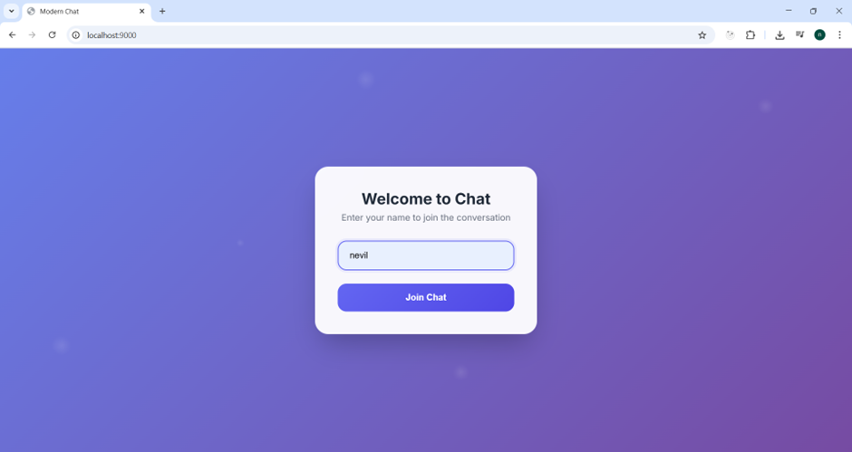
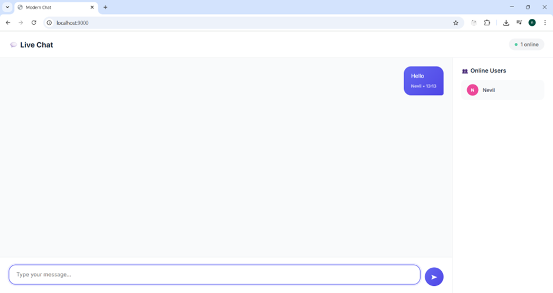
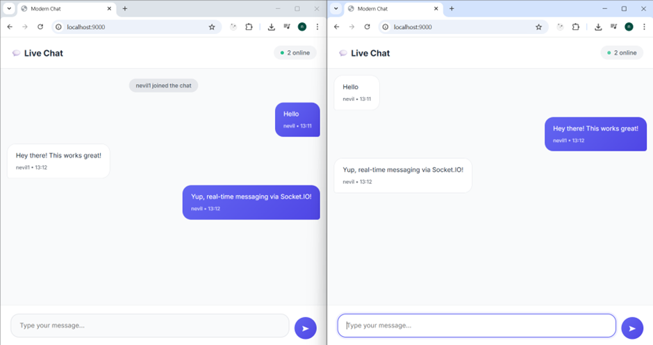

# socketio-realtime-chat

A real-time chat application built with **Node.js**, **Express**, and **Socket.IO**. It supports multi-user messaging over WebSocket, ideal for learning real-time web communication.

## 🚀 Features

- Real-time messaging with Socket.IO
- Simple and clean frontend UI
- Multi-user support
- Built with Express.js and Node.js

## 🛠️ Technologies Used

- Node.js
- Express.js
- Socket.IO
- HTML/CSS/JavaScript

## 📦 Installation

1. **Clone the repository**
   ```bash
   git clone https://github.com/NEVIL5249/socketio-realtime-chat.git
   cd socketio-realtime-chat
   ```

2. **Install dependencies**
   ```bash
   npm install
   ```

3. **Start the server**
   ```bash
   node index.js
   ```

4. **Open in browser**
   ```
   http://localhost:9000
   ```

## 📁 Project Structure

```
CHATAPP-SOCKETIO/
│
├── assets/ # Screenshots
│
├── node_modules/ # Node.js packages (auto-generated)
│
├── public/ # Frontend files
│ ├── index.html # Main HTML file
│ └── styles.css # Styling for the UI
│
├── .gitignore # Git ignore rules
├── index.js # Main server file
├── package.json # Project metadata and dependencies
├── package-lock.json # Exact dependency tree
└── README.md # Project documentation

```

## 🧪 Demo

### 👋 Welcome Screen


> **Figure 1:** User enters their name to join the chat room.

### 💬 Single User Interface


> **Figure 2:** A user sends a message. The message is displayed on the right with their name and timestamp.

### 🌐 Real-Time Messaging Between Two Users


> **Figure 3:** Two users chatting in real time using Socket.IO across two browser windows.

